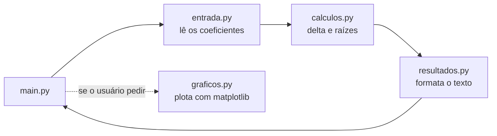

<div align="center">

# 🧮 Bhaskara

### A mesma calculadora, resolvida de três jeitos diferentes


-11557C)


</div>

Calculadora da fórmula de Bhaskara (equação do 2º grau), implementada **três vezes** com o
mesmo recorte de responsabilidades — pra comparar estilo procedural contra orientado a objetos,
terminal contra interface gráfica, sem nunca misturar cálculo com entrada/saída.

> [!NOTE]
> O objetivo deste projeto nunca foi a fórmula em si — é mostrar **separação de responsabilidades**
> na prática. Escrito como teste do Copilot CLI.

## 📑 Sumário

- [⚖️ Comparando as três versões](#️-comparando-as-três-versões)
- [🧩 O contrato entre os módulos](#-o-contrato-entre-os-módulos)
- [🔀 Fluxo entre os arquivos](#-fluxo-entre-os-arquivos)
- [🚀 Como executar](#-como-executar)
- [🧪 Casos de teste](#-casos-de-teste)
- [📁 Estrutura de pastas](#-estrutura-de-pastas)

## ⚖️ Comparando as três versões

| | [`normal/`](normal/) (Estruturado) | [`oop/`](oop/) (OOP) | [`opp_com_janelas/`](opp_com_janelas/) (OOP_Janelas) |
|---|---|---|---|
| **Estilo** | Funções soltas | Classe `EquacaoSegundoGrau` | Classe `EquacaoSegundoGrau` |
| **Interface** | Terminal (`input()`) | Janela (tkinter) | Janela (tkinter) |
| **Entrada aceita** | Vírgula ou ponto decimal | Vírgula ou ponto decimal | Vírgula ou ponto decimal |
| **Validação de `a = 0`** | Repete a pergunta no terminal | Mensagem de erro na janela | Mensagem de erro na janela |
| **Gráfico** | Opcional, pergunta no final | Botão "Exibir gráfico" | Botão "Exibir gráfico" |

> [!WARNING]
> `oop/` e `opp_com_janelas/` implementam exatamente a mesma coisa — mesma classe, mesma
> janela, mesmo comportamento. Hoje divergem só em um comentário e uma docstring, nada
> funcional. Ainda não foi decidido se uma das duas é redundante ou se vão divergir de
> propósito mais pra frente.

## 🧩 O contrato entre os módulos

Cada versão segue a mesma divisão, e a regra nunca muda de uma pasta pra outra:

| Arquivo | Responsabilidade |
|---|---|
| `main.py` | Orquestra — só chama os outros, não calcula nem lê nada sozinho |
| `entrada.py` | O único arquivo que lê dado do usuário (`input()` ou campo da janela) |
| `calculos.py` | Matemática pura — sem `print`, sem `input`, sem import de interface |
| `resultados.py` | Formata o texto de saída a partir do que `calculos.py` devolveu |
| `graficos.py` | Desenha o gráfico com `matplotlib` — opcional, nunca derruba o programa |

> [!TIP]
> `graficos.py` degrada sozinho se o `matplotlib` não estiver instalado: mostra um aviso
> pedindo pra instalar e segue em frente, em vez de travar com `ModuleNotFoundError`.

## 🔀 Fluxo entre os arquivos



## 🚀 Como executar

```bash
git clone https://github.com/teste-aluno-ifma/Bhaskara.git
cd Bhaskara
python3 -m venv .venv && source .venv/bin/activate
pip install matplotlib   # opcional — só pra quem quiser ver o gráfico
```

```bash
python normal/main.py             # versão de terminal
python oop/main.py                # versão com janela
python opp_com_janelas/main.py    # versão com janela (igual à de cima)
```

> [!TIP]
> A versão com janela usa `tkinter`, que já vem com o Python na maioria das instalações —
> no Linux, se faltar, instale com `sudo apt install python3-tk` (Debian/Ubuntu).

## 🧪 Casos de teste

| Entrada (a, b, c) | Delta | Resultado |
|---|---|---|
| 1, -5, 6 | 1 | duas raízes reais (2 e 3) |
| 1, 2, 1 | 0 | uma raiz real (-1) |
| 1, 0, 1 | -4 | nenhuma raiz real |
| 2,5, 3, 1 | -1 | nenhuma raiz real (vírgula aceita como decimal) |

## 📁 Estrutura de pastas

<details>
<summary>Clique para expandir</summary>

```text
Bhaskara/
├── normal/              # versão procedural, terminal
│   ├── main.py
│   ├── entrada.py
│   ├── calculos.py
│   ├── resultados.py
│   └── graficos.py
├── oop/                 # versão com classe, janela (tkinter)
│   ├── main.py
│   ├── entrada.py
│   ├── calculos.py
│   ├── resultados.py
│   └── graficos.py
├── opp_com_janelas/     # versão com classe, janela (tkinter)
│   ├── main.py
│   ├── entrada.py
│   ├── calculos.py
│   ├── resultados.py
│   └── graficos.py
├── .gitignore
└── README.md
```

</details>
